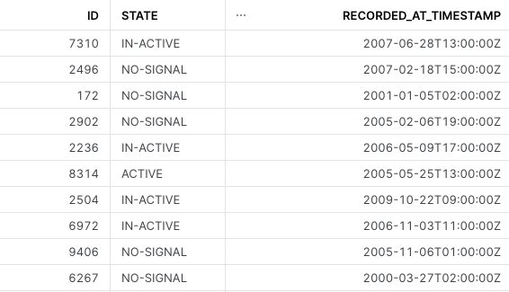
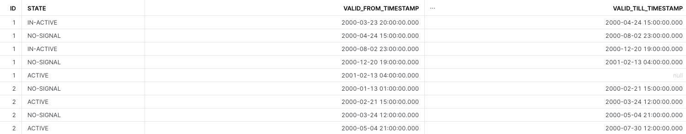

# **Gaps & Islands**

!!! info "note"
    
    The SQL here was tested in Snowflake. Solution needs explanation.

## **Situation:**
You have many sensors which report their status on the hour when their state changes.
Sometimes the sensors will report their state even when the state hasn't changed.

These sensors can be in one of three states:

1. ACTIVE
2. IN-ACTIVE
3. NO-SIGNAL

Lets generate some data:
~~~ sql
WITH RAW_SENSOR_DATA AS (
    SELECT
        UNIFORM(1, 1000, RANDOM()) AS ID,
        CASE UNIFORM(1, 3, RANDOM())
            WHEN 1 THEN 'ACTIVE'
            WHEN 2 THEN 'IN-ACTIVE'
            WHEN 3 THEN 'NO-SIGNAL'
            END AS STATE,
        DATEADD(HOUR, UNIFORM(1, 10000, RANDOM()), '2000-01-01 00:00:00.000 -0800') AS RECORDED_AT_TIMESTAMP
    FROM TABLE(GENERATOR(rowCount => 10000))
)
SELECT *
FROM RAW_SENSOR_DATA;
~~~

## **Requirement:**
Shrink the records down into a list of timeframes showing when each sensor was in what state.

Your output should have the following columns:

* ID
* STATE
* VALID_FROM_TIMESTAMP
* VALID_TILL_TIMESTAMP

The latest state of each sensor should have a `VALID_TILL_TIMESTAMP` that is `null`.

## **Solution:**

~~~ sql
WITH RAW_SENSOR_DATA AS (
    SELECT
        UNIFORM(1, 1000, RANDOM()) AS ID,
        CASE UNIFORM(1, 3, RANDOM())
            WHEN 1 THEN 'ACTIVE'
            WHEN 2 THEN 'IN-ACTIVE'
            WHEN 3 THEN 'NO-SIGNAL'
            END AS STATE,
        DATEADD(HOUR, UNIFORM(1, 10000, RANDOM()), '2000-01-01 00:00:00.000 -0800') AS RECORDED_AT_TIMESTAMP
    FROM TABLE(GENERATOR(rowCount => 10000))
),
RANKED AS (
  SELECT
    *,
    DENSE_RANK() OVER (PARTITION BY ID ORDER BY RECORDED_AT_TIMESTAMP)
    - DENSE_RANK() OVER (PARTITION BY ID, STATE ORDER BY RECORDED_AT_TIMESTAMP) AS SEQ
  FROM RAW_SENSOR_DATA
),
DEDUPE AS (
  SELECT
    ID,
    STATE,
    MIN(RECORDED_AT_TIMESTAMP) AS RECORDED_AT_TIMESTAMP
  FROM RANKED
  group by ID, STATE, SEQ
)
SELECT
    ID,
    STATE,
    RECORDED_AT_TIMESTAMP AS VALID_FROM_TIMESTAMP,
    LEAD(RECORDED_AT_TIMESTAMP) OVER (PARTITION BY ID ORDER BY RECORDED_AT_TIMESTAMP) AS VALID_TILL_TIMESTAMP
FROM DEDUPE
ORDER BY ID, VALID_FROM_TIMESTAMP;
~~~
