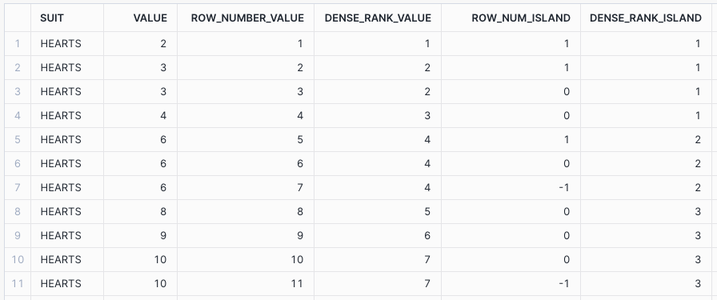
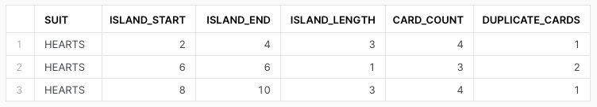

# **Gaps & Islands (Part 1)**

**Gaps:** Absense of values within a sequence

**Islands:** Unbroken sequences separated by gaps

## Setup
In order to attempt to explain this sql challenge I've decided to use a deck of cards, something
we all can recognise, as my analogy.
~~~ sql
CREATE TABLE CARDS (
    SUIT STRING,
    VALUE INTEGER
);
INSERT INTO CARDS
VALUES
('HEARTS', 2),
('HEARTS', 3),
('HEARTS', 4),
('HEARTS', 6),
('HEARTS', 8),
('HEARTS', 9),
('HEARTS', 10);
~~~

## Detecting Gaps
~~~ sql
SELECT
    SUIT,
    VALUE,
    ROW_NUMBER() OVER (PARTITION BY SUIT ORDER BY VALUE ASC) AS ROW_NUM
FROM CARDS;
~~~

We know that in a single suit that there is 13 cards, if we check `MAX(ROW_NUM)` 
we can see that it's less than our expected value, therefore this is one indicator of gaps.

## Identifying Islands
~~~ sql
SELECT
    SUIT,
    VALUE,
    ROW_NUMBER() OVER (PARTITION BY SUIT ORDER BY VALUE ASC) AS ROW_NUM,
    VALUE - ROW_NUMBER() OVER (PARTITION BY SUIT ORDER BY VALUE ASC) AS ISLAND
FROM CARDS;
~~~

By subtracting the row number from the card value we can see where our islands are.

## Managing Duplicates
Unfortunately when it comes to data, we don't always have perfect data sources, 
so what happens if duplicates are present?
~~~ sql
INSERT INTO CARDS
VALUES
('HEARTS', 3),
('HEARTS', 6),
('HEARTS', 6),
('HEARTS', 10);
~~~

Here we can see that if our data contains duplicates then row number's usefulness breaks down however in SQL
however there is more than one ranking function we could use, how about dense rank?
~~~ sql
SELECT
    SUIT,
    VALUE,
    ROW_NUMBER() OVER (PARTITION BY SUIT ORDER BY VALUE ASC) AS ROW_NUMBER_VALUE,
    DENSE_RANK() OVER (PARTITION BY SUIT ORDER BY VALUE ASC) AS DENSE_RANK_VALUE,
    VALUE - ROW_NUMBER() OVER (PARTITION BY SUIT ORDER BY VALUE ASC) AS ROW_NUM_ISLAND,
    VALUE - DENSE_RANK() OVER (PARTITION BY SUIT ORDER BY VALUE ASC) AS DENSE_RANK_ISLAND
FROM CARDS;
~~~
As you can see, dense rank is able to work where row number fails.

**Row Number:** Returns an incrementing value for all rows sequentially

**Dense Rank:** Returns an incrementing value for all rows sequentially
however rows with the same ordering & partitioning will end up with the same value

## Grouping Islands
If we group the islands together we start to get a clearer picture of what we have verses what we don't have.
~~~ sql
WITH ISLANDS AS (
    SELECT
        SUIT,
        VALUE,
        VALUE - DENSE_RANK() OVER (PARTITION BY SUIT ORDER BY VALUE ASC) AS ISLAND
    FROM CARDS
)
SELECT
    SUIT,
    MIN(VALUE) AS ISLAND_START,
    MAX(VALUE) AS ISLAND_END,
    MAX(VALUE) - MIN(VALUE) + 1 AS ISLAND_LENGTH,
    COUNT(SUIT, VALUE) AS CARD_COUNT,
    COUNT(SUIT, VALUE) - COUNT(DISTINCT SUIT, VALUE) AS DUPLICATE_CARDS
FROM ISLANDS
GROUP BY SUIT, ISLAND;
~~~

## Identifying gaps
Now that we have identified the islands, what about the gaps? How big are they, how many are there?
~~~ sql
WITH BOUNDED AS (
    SELECT SUIT, VALUE
    FROM CARDS
    UNION
    SELECT 'HEARTS' AS SUIT, 0 AS VALUE
    UNION
    SELECT 'HEARTS' AS SUIT, 14 AS VALUE
),
OFFSETS AS (
    SELECT
        SUIT,
        VALUE,
        LEAD(VALUE) OVER (PARTITION BY SUIT ORDER BY VALUE ASC) AS NEXT_VALUE
    FROM BOUNDED
)
SELECT
    SUIT,
    VALUE + 1 AS GAP_START,
    NEXT_VALUE - 1 AS GAP_END,
    GAP_END - GAP_START + 1 AS MISSING_CARD_COUNT
FROM OFFSETS
WHERE GAP_END >= GAP_START;
~~~

If we set the bounds for our values, 1-13 (inclusive), then we can programmatically work out 
where each gap starts & ends.

