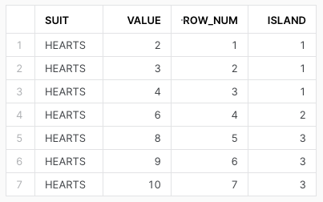
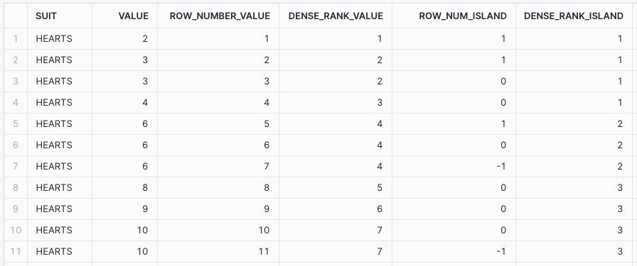
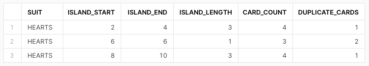
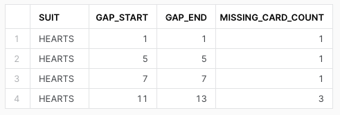

# **Mastering SQL Challenges: Gaps & Islands**
In the vast landscape of SQL, mastering its intricacies often involves tackling unique challenges that go
beyond simple queries. One such challenge that frequently perplexes SQL practitioners is dealing with 
"gaps and islands". While the term might sound like something out of a nautical adventure, in the realm
of databases, it refers to a common problem of identifying breaks (gaps) and contiguous sequences
(islands) within a dataset.

## **What are gaps and islands?**
Before delving into the solutions, let's clarify what we mean by "gaps" and "islands" in the context of SQL.

**Gaps:** The absence of values within a sequence. For instance, imagine a table of timestamps representing events.
If there's a gap between two timestamps, it indicates that there were no events during that period.

**Islands:** Unbroken sequences separated by gaps. In the same table of timestamps, islands would represent
uninterrupted periods where events occurred continuously.

## **The Challenge**
So, why are gaps and islands a challenge? The complexity arises from the fact that SQL operates on sets of data
which aren't inherently ordered. Consequently, identifying sequential patterns isn't straightforward, especially 
when dealing with large datasets or data with irregular intervals.

### **Possible strategies**
Fortunately, SQL offers several techniques to address challenges effectively. Here are some common approaches:

1. **Analytic Functions:** Functions like `ROW_NUMBER()`, `DENSE_RANK()`, `LEAD()` and `LAG()` are invaluable
   for identifying and categorising sequences of data.
2. **Recursive CTEs (Common Table Expressions):** While potentially complex and inefficient, they allow for
   iterative processing of data, making them useful for tasks involving hierarchical or sequential structures.
3. **Self-Joins:** Another appreach involves self-joining datasets on themselves, comparing adjacent rows to
   detect transitions between gaps and islands. While this method can be resource-intensive for large datasets, 
   it provides a straightforward way to visualise and understand the data's sequential patterns.

### **Setup**
Lets illustrate some of these techniques with a practical example.

Suppose we have a table which is representative of a deck of cards.
~~~ sql
CREATE TABLE CARDS (
    SUIT STRING,
    VALUE INTEGER
);
INSERT INTO CARDS
VALUES
('HEARTS', 2),
('HEARTS', 3),
('HEARTS', 4),
('HEARTS', 6),
('HEARTS', 8),
('HEARTS', 9),
('HEARTS', 10);
~~~

### **Detecting Gaps**
~~~ sql
SELECT
    SUIT,
    VALUE,
    ROW_NUMBER() OVER (PARTITION BY SUIT ORDER BY VALUE ASC) AS ROW_NUM
FROM CARDS;
~~~

We know that in a single suit that there is 13 cards, if we check `MAX(ROW_NUM)` 
we can see that it's less than our expected value, therefore this is one indicator of gaps.

### **Identifying Islands**
~~~ sql
SELECT
    SUIT,
    VALUE,
    ROW_NUMBER() OVER (PARTITION BY SUIT ORDER BY VALUE ASC) AS ROW_NUM,
    VALUE - ROW_NUMBER() OVER (PARTITION BY SUIT ORDER BY VALUE ASC) AS ISLAND
FROM CARDS;
~~~

By subtracting the row number from the card value we can see where our islands are.

### **Managing Duplicates**
Unfortunately when it comes to data, we don't always have perfect data sources, 
so what happens if duplicates are present?
~~~ sql
INSERT INTO CARDS
VALUES
('HEARTS', 3),
('HEARTS', 6),
('HEARTS', 6),
('HEARTS', 10);
~~~

Here we can see that if our data contains duplicates then row number's usefulness breaks down however in SQL
however there is more than one ranking function we could use, how about dense rank?
~~~ sql
SELECT
    SUIT,
    VALUE,
    ROW_NUMBER() OVER (PARTITION BY SUIT ORDER BY VALUE ASC) AS ROW_NUMBER_VALUE,
    DENSE_RANK() OVER (PARTITION BY SUIT ORDER BY VALUE ASC) AS DENSE_RANK_VALUE,
    VALUE - ROW_NUMBER() OVER (PARTITION BY SUIT ORDER BY VALUE ASC) AS ROW_NUM_ISLAND,
    VALUE - DENSE_RANK() OVER (PARTITION BY SUIT ORDER BY VALUE ASC) AS DENSE_RANK_ISLAND
FROM CARDS;
~~~
As you can see, dense rank is able to work where row number fails.

**Row Number:** Returns an incrementing value for all rows sequentially

**Dense Rank:** Returns an incrementing value for all rows sequentially
however rows with the same ordering & partitioning will end up with the same value

### **Grouping Islands**
If we group the islands together we start to get a clearer picture of what we have verses what we don't have.
~~~ sql
WITH ISLANDS AS (
    SELECT
        SUIT,
        VALUE,
        VALUE - DENSE_RANK() OVER (PARTITION BY SUIT ORDER BY VALUE ASC) AS ISLAND
    FROM CARDS
)
SELECT
    SUIT,
    MIN(VALUE) AS ISLAND_START,
    MAX(VALUE) AS ISLAND_END,
    MAX(VALUE) - MIN(VALUE) + 1 AS ISLAND_LENGTH,
    COUNT(SUIT, VALUE) AS CARD_COUNT,
    COUNT(SUIT, VALUE) - COUNT(DISTINCT SUIT, VALUE) AS DUPLICATE_CARDS
FROM ISLANDS
GROUP BY SUIT, ISLAND;
~~~

### **Identifying gaps**
Now that we have identified the islands, what about the gaps? How big are they, how many are there?
~~~ sql
WITH BOUNDED AS (
    SELECT SUIT, VALUE
    FROM CARDS
    UNION
    SELECT 'HEARTS' AS SUIT, 0 AS VALUE
    UNION
    SELECT 'HEARTS' AS SUIT, 14 AS VALUE
),
OFFSETS AS (
    SELECT
        SUIT,
        VALUE,
        LEAD(VALUE) OVER (PARTITION BY SUIT ORDER BY VALUE ASC) AS NEXT_VALUE
    FROM BOUNDED
)
SELECT
    SUIT,
    VALUE + 1 AS GAP_START,
    NEXT_VALUE - 1 AS GAP_END,
    GAP_END - GAP_START + 1 AS MISSING_CARD_COUNT
FROM OFFSETS
WHERE GAP_END >= GAP_START;
~~~

If we set the bounds for our values, 1-13 (inclusive), then we can programmatically work out 
where each gap starts & ends.

## **Conclusion**
Mastering SQL's capabilities for handling challenges like gaps and islands opens up a world of possibilities
for data analysis and manipulation. By leveraging analytical functions, recursive queries and other advanced SQL
features, you can efficiently tackle complex problems and extract valuable insights from your datasets.

Whether you're working with time-series data, event logs or any other sequential data structures, understanding 
and implementing these techniques will empower you to navigate the seas of SQL with confidence, charting a course
toward more insightful and efficient analysis of your data.
